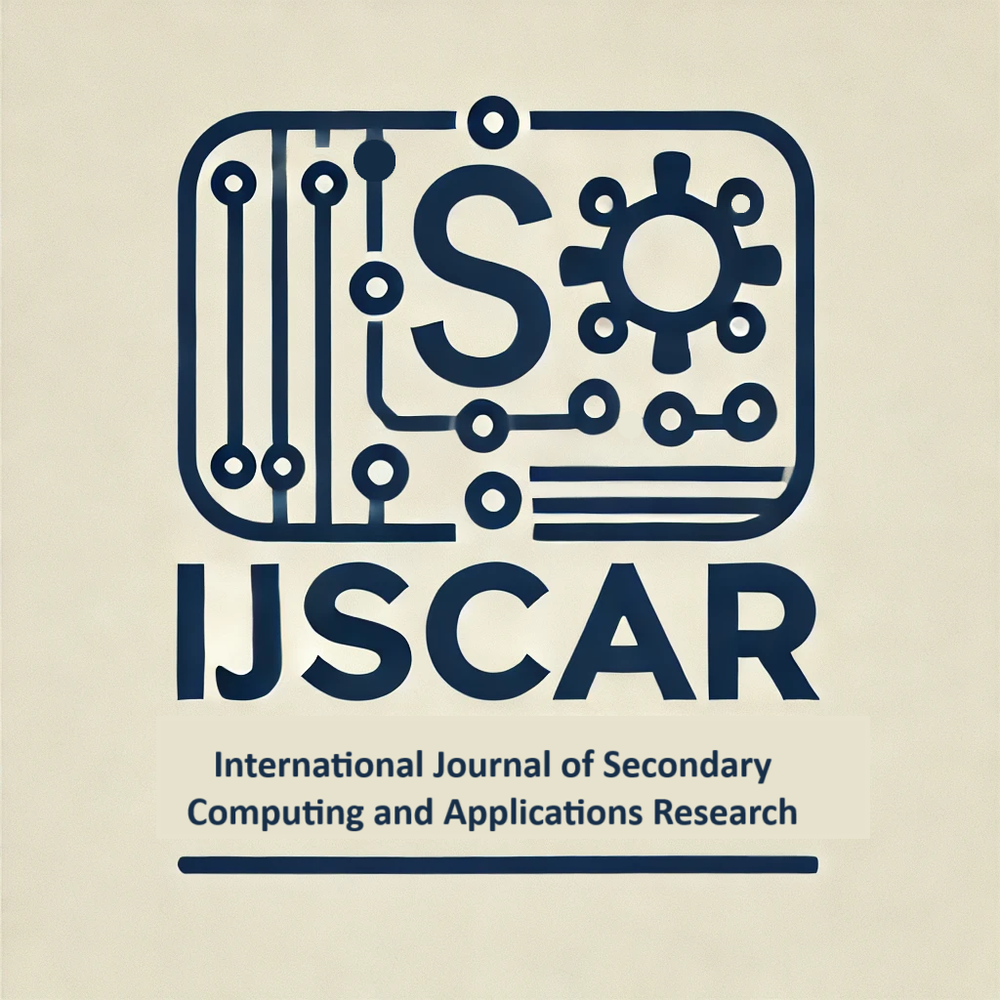

IJSCAR is a highly-selective, open-access journal dedicated to publishing high-quality research in the field of computing and applications, with a special focus on researchers in secondary school.

IJSCAR is meant to fill a gap in the space of academic journals for computing and high school students.
While there are many journals that publish research in computing, there are few that are specifically designed to cater to the needs of secondary school students. 
On the other hand, existing journals for high school students are often more focused on science research in general and do not provide a dedicated platform for computing research.
Computing research has a fundamentally different methodology and set of tools compared to other scientific disciplines, and we believe that it is important to provide a space where young researchers can publish their work and engage with the broader computing research community.
Our goal is to, by providing a platform for young researchers to publish their work, help to foster the next generation of computing researchers.

## About IJSCAR

The International Journal of Secondary Computing and Applications Research (IJSCAR) is a peer-reviewed academic journal that focuses on the latest advancements in computing and its applications broadly construed. We accept papers across a range of computing disciplines, including, but not limited to:

- Artificial Intelligence/Machine Learning
- Bioinformatics/Biomedical Informatics
- Human-Computer Interaction
- Social Aspects of Computing
- Software Engineering
- Programming Languages
- Computer Vision and Graphics
- Robotics
- Databases
- Computer Systems and Networks
- Cybersecurity

If you do not see your specific area of research listed above, please feel free to submit your work. We are open to a wide range of topics within the field of computing and applications of computing.

Our mission is to disseminate cutting-edge research that can contribute to the development and understanding of computing, while supporting the next generation of researchers. 
To this end, every paper must include at least one co-author who is enrolled in secondary school at the time of submission.

## Editorial Board

- **Editor-in-Chief:** Dr. Maria Hwang, Fashion Institute of Technology. Associate Professor of Computer Science.
- **Editorial Board:**
  - Dr. Mark Santolucito, Barnard College, Columbia University. Assistant Professor of Computer Science.
  - Dr. Selen Türkay, School of Computer Science, Queensland University of Technology. Associate Professor of Computer Science. 
  - Dr. Woonhee Sung, The University of Texas at Tyler. Assistant Professor of Instructional Technology.
  - Dr. Maria Hwang, Fashion Institute of Technology. Assistant Professor of Computer Science.

## Submission Guidelines

We invite researchers and practitioners to submit their original research papers, literature reviews, and case studies. Manuscripts should be formatted according to the following guidelines:

1. **Format:** Manuscripts should be submitted in LaTeX format using the provided [LaTeX Template](https://www.overleaf.com/latex/templates/acm-conference-proceedings-primary-article-template/wbvnghjbzwpc).
2. **Length:** Articles should be at least 2 pages, and not exceed 10 pages, not including references and appendices.
3. **Submission:** Send your manuscript to [submissions@ijscar.org](mailto:submissions@ijscar.org).

### Review Process

Each of the reviewers will assign a score to the paper of 

- Accept as is
- Accept with minor revisions
- Major revisions required
- Reject

The final decision will be made by the editor-in-chief based on the reviews and the scores of the reviewers.

A paper with Accept with minor revisions will be accepted after the authors have made the requested changes.

A paper with Major revisions required will be invited to be resubmitted after the authors have made the requested changes. In this case, the paper will be sent back to the original reviewers for a second review.

In recoginition of the fact that many of our authors are early stage researchers, we have a policy of encouraging resubmission.
Authors are encouraged to iterate on their paper to work towards an Accept as is decision. There is no limit to the number of times a paper can be resubmitted.
Authors may also choose to withdraw their paper at any time in case they feel that, based on the reviewer feedback, the paper is not a good fit for the journal.

To ensure a high level of academic rigor, all submissions will undergo a transparent peer review process. 
This means that the identities of the authors and reviewers will be made known to both parties.
All reviewers are experts in the field of computing and applications research and will provide detailed feedback to help authors improve their work.
Specifically all reviewers hold a PhD in a relevant field. 
We do allow subreviews from graduate students of professors who are reviewers, as a way to engage the next generation of researchers in the review process.
All reviewers (or subreviewers where relevant) will be paid a small stipend for their review.

In the case that a paper does not meet the formatting or authorship guidelines, or is outside the scope of the call for papers, the Edito-in-Cheif may make a decision to Desk Reject a paper without review.

### Timeline

The timeline for the review process is as follows:

- **Initial Submission** 
- **Initial Reviews:** Within two weeks of submission 
- **Rebuttal Due:** One week after receiving reviews
- **Final Decision:** One week after rebuttal
- **Publication:** At the next available issue

### Specific Requirements for High School Student Authors

At IJSCAR, we require that at least one author of each submission be a high school student. 
This is to ensure that the journal remains focused on the needs and interests of secondary school students.

## Publishing Policy

All articles are published as open-access and are assigned a DOI so that they can be indexed by major databases, facilitating easy access, citation, and integration into academic and research libraries.

There is no fee to submit an article.
Typically, academic journals do not pay their reviewers in exchange for credit of ``academic service''.
In recognition of the time and effort that goes into reviewing papers, and in service of moving towards a more equitable academic publishing model, we run a unique reviewing process where all reviewers are paid a modest stipend per review.
In order to cover these costs of the review process as well as publication, for accepted papers only, we charge a $450 USD administrative fee.
**As a new journal, we are currently waiving this fee.**

## Contact Us

For any inquiries, please contact us at:

- **Email:** [contact@ijscar.org](mailto:contact@ijscar.org)
- **Address:** 217 Manhattan Ave, Unit 4C, New York, NY 10025, USA

<!--- Follow us on [Twitter](https://twitter.com/ijscar) and [LinkedIn](https://www.linkedin.com/company/ijscar). --->
