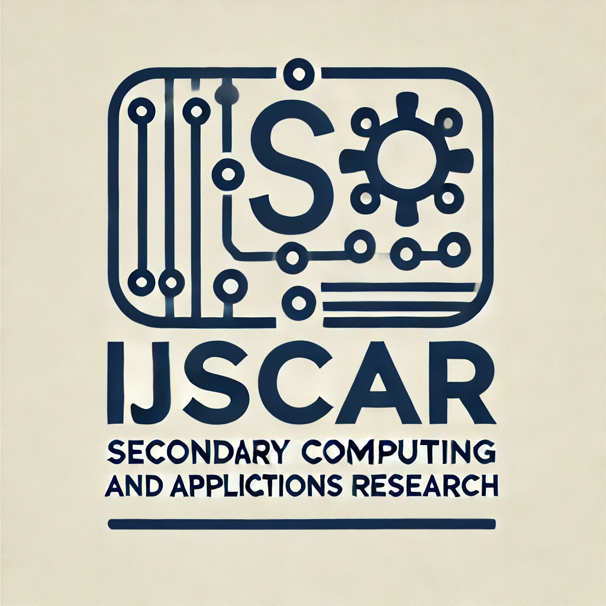

# International Journal of Secondary Computing and Applications Research (IJSCAR)

Welcome to the official website of the International Journal of Secondary Computing and Applications Research (IJSCAR). IJSCAR is dedicated to publishing high-quality research in the field of secondary computing and applications. The term "secondary" refers to secondary education, specifically targeting high school students.

## About IJSCAR

The International Journal of Secondary Computing and Applications Research (IJSCAR) is a peer-reviewed academic journal that focuses on the latest advancements in secondary computing and its applications. Our mission is to disseminate cutting-edge research that can contribute to the development and understanding of secondary computing. We emphasize student involvement, requiring at least one author per paper to be a high school student.

## Editorial Board

- **Editor-in-Chief:** Dr. Jane Doe, University of Somewhere
- **Associate Editors:**
  - Dr. John Smith, Institute of Technology
  - Dr. Alice Brown, Science University
  - Dr. Mark Johnson, Research Academy
- **Editorial Assistants:**
  - Emily White
  - Michael Green

## Submission Guidelines

We invite researchers and practitioners to submit their original research papers, review articles, and case studies. Manuscripts should be formatted according to the following guidelines:

1. **Format:** Manuscripts should be submitted in MS Word or LaTeX format.
2. **Length:** Articles should not exceed 8000 words, including references and appendices.
3. **Abstract:** Include an abstract of 200-300 words.
4. **References:** Use APA citation style for references.
5. **Submission:** Send your manuscript to [submission@ijscar.org](mailto:submission@ijscar.org).

### Specific Requirements for High School Student Authors

At IJSCAR, we require that at least one author of each submission be a high school student. This aligns with our commitment to fostering young talent in the field of computing research.

For detailed submission guidelines, please visit our [Submission Guidelines](submission-guidelines.md) page.

## Archives

Browse our [Archives](archives.md) to access past issues.

## Contact Us

For any inquiries, please contact us at:

- **Email:** [contact@ijscar.org](mailto:contact@ijscar.org)
- **Phone:** +123-456-7890
- **Address:** IJSCAR Office, 123 Research Lane, City, Country

Follow us on [Twitter](https://twitter.com/ijscar) and [LinkedIn](https://www.linkedin.com/company/ijscar).

---

© 2024 International Journal of Secondary Computing and Applications Research (IJSCAR). All rights reserved.
