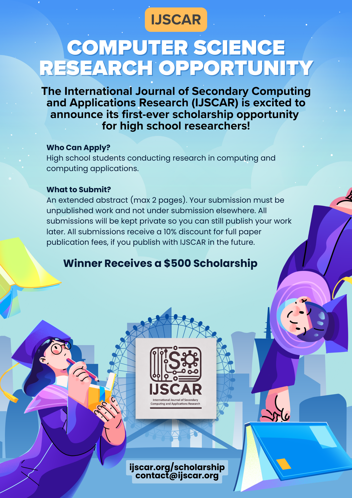

# 2025 IJSCAR Scholarship Program

IJSCAR is proud to announce the **IJSCAR Scholarship for Excellence in Secondary School Research**, recognizing outstanding original research in computing and its applications by secondary school students.

## Scholarship Overview

The IJSCAR Scholarship is awarded to students whose research demonstrates creativity, rigor, and relevance in the field of computer science. We aim to encourage early engagement with research and promote the next generation of innovators.

## Award

The winner will receive **$500 USD** and have the chance to have their extended abstract published in the next issue of IJSCAR.

## Eligibility

To apply, you must:

- Be a current **secondary school student** (equivalent to US grades 9-12).
- Prepare a 2 page (max), anonymized extended abstract of your **research project in computer science or a related area**. Please use the [IJSCAR Overleaf template](https://www.overleaf.com/read/ggbvzrsvpnhs#b64746)
- The work should be original and not published, or under review elsewhere.

## Application Process

Please complete the [application form](https://docs.google.com/forms/d/e/1FAIpQLSfqrdhEK9quy5GZQMxLWoX5gsvSpDT6hqY5HRNv_KL-MY8E8A/viewform?usp=sharing) by **May 1, 2025**. For this form, you will need to provide:

1. Your name and contact information.
2. Your school and grade.
3. A 2 page extended abstract of your research project in computer science or a related area. Please use the [IJSCAR Overleaf template](https://www.overleaf.com/read/ggbvzrsvpnhs#b64746).
4. The email of a computer science teacher or mentor. For the top candidates, we will contact the teacher for verificiation of student status.

## Evaluation Criteria

The evaluation process is double-blind.
Please ensure that your name and contact information are not included in the pdf.
Submissions will be evaluated by the IJSCAR editorial board based on:

- Originality and impact of the research.
- Technical quality and clarity.
- Contribution to the field of computing.

## Timeline

- **Deadline:** May 1, 2025  
- **Results Announced:** June 1, 2025  
- **Publication Date:** Optionally, at no fee, the winning extended abstract will be published in the next issue of IJSCAR. Note this may require some revisions to the extended abstract to meet the journal's formatting standards. If the author would like to publish their work at another venue instead of with IJSCAR, they are welcome to do so.

## Contact

For any questions, please reach out to:

📧 **contact@ijscar.org**

We look forward to reviewing your work and celebrating student achievement in computer science research!
